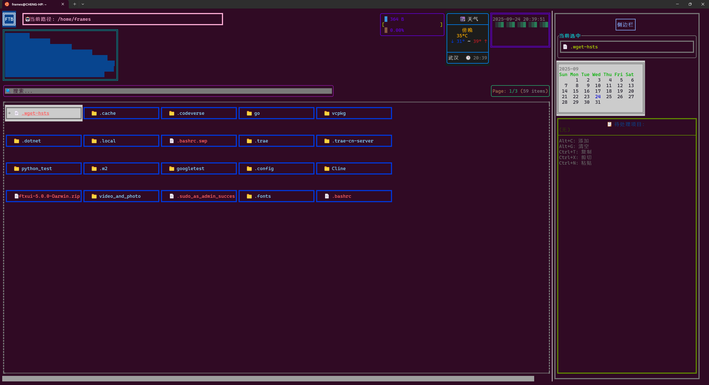

<div align="center">

# FTB (Terminal File Browser)

</div>

<div align="center">
  
</div>

    
 

    <a href="#"></img></a>

A powerful terminal-based interactive file browser developed using FTXUI library, providing intuitive directory navigation, file management, **SSH remote connection**, and **MySQL database management** capabilities. Built with **high-performance optimizations** including smart memory management, asynchronous file operations, and object pooling for smooth user experience.

## Demo



## Features

### 🗂️ Core File Management
- Real-time directory content display
- Color-coded items (blue for directories/red for files)
- Top status bar with current time
- Path history stack (support backward navigation)
- Keyboard navigation (↑↓ keys for selection, Enter to enter directories)
- Auto-refresh (100ms UI update interval)
- Directory search functionality
- Memory usage calculation for selected items

### 🛠️ File Operations
- File/folder creation and deletion
- Copy, cut, and paste operations
- File/folder renaming
- Clipboard management
- Attribute preview and file content inspection

### 📝 Advanced Features
- **Vim-Like editing mode** - Built-in text editor
- **Image preview** - Support for JPG, PNG, BMP, GIF
- **Video playback** - MP4, AVI, MKV, MOV, FLV, WMV support
- **Binary file handling** - Smart detection and protection

### 🔗 **SSH Remote Connection** ✨
- **Secure SSH connections** to remote servers
- **Password and key-based authentication**
- **Remote directory browsing**
- **Command execution** on remote hosts
- **Connection status monitoring**
- **Easy-to-use connection dialog**

### 🗄️ **MySQL Database Management** ✨
- **Local and remote MySQL connections** with easy configuration
- **Graphical CRUD operations** through intuitive button interface
- **Database management** - create, delete, and select databases
- **Table operations** - create, delete, and view table structures
- **Data manipulation** - insert, update, delete, and query data
- **SQL query executor** - direct SQL execution with result display
- **Connection status monitoring** and error handling
- **Tabbed interface** for organized database management

### 🌐 **Network Service Management** ✨
- **Network connection monitoring** with real-time status updates
- **Connection information display** - IP addresses, MAC addresses, signal strength
- **Network statistics tracking** - data transfer, packet counts, speed monitoring
- **Network speed testing** with multiple test hosts and latency measurement
- **WiFi network scanning** and connection management
- **Network diagnostics** with comprehensive connection testing
- **Tabbed interface** for organized network management
- **Keyboard navigation** with full keyboard support

### 🎨 **Customizable Theme System** ✨
- **Multiple built-in themes**: default, dark, light, colorful, minimal
- **Customizable colors** for all interface elements
- **Real-time theme switching** with hotkeys
- **Configuration file support** (.ftb) for persistent customization
- **Color schemes** for files, directories, status bars, and dialogs
- **Layout customization** including panel ratios and item counts
- **Style options** for icons, animations, and mouse support

### ⚡ **Performance Optimizations** ✨
- **Smart Memory Management**: Intelligent pointer usage and container pre-allocation
- **Asynchronous File Operations**: Non-blocking file I/O for smooth UI experience
- **Object Pooling**: Efficient resource reuse for frequently created objects
- **LRU Caching**: Multi-level caching system for directory contents and file metadata
- **Memory Pool**: Reduced memory fragmentation and allocation overhead
- **Background Processing**: File operations run in separate threads

### 🎨 User Experience
- Modern terminal UI with FTXUI
- Responsive design and smooth animations
- Intuitive keyboard shortcuts
- Error handling and user feedback

## Dependencies

### Core Dependencies
```bash
# Essential libraries
sudo apt-get install libftxui-dev libssh2-1-dev libmysqlclient-dev

# JSON processing
sudo apt-get install nlohmann-json3-dev

# YAML configuration support
sudo apt-get install libyaml-cpp-dev

# Threading and performance
sudo apt-get install libtbb-dev
```

### Media Support (Optional)
```bash
# Video/image processing libraries
sudo apt-get install libavcodec-dev libavformat-dev libavutil-dev libswscale-dev

# X11 support for media display
sudo apt-get install libx11-dev
```

### Development Tools
```bash
# CMake build system
sudo apt-get install cmake

# C++ compiler
sudo apt-get install g++-11
```

### Dependency Overview

| Library | Purpose | Required | Package Name |
|---------|---------|----------|--------------|
| **FTXUI** | Terminal UI framework | ✅ | libftxui-dev |
| **libssh2** | SSH connections | ✅ | libssh2-1-dev |
| **MySQL** | Database connectivity | ✅ | libmysqlclient-dev |
| **nlohmann-json** | JSON processing | ✅ | nlohmann-json3-dev |
| **yaml-cpp** | YAML configuration | ✅ | libyaml-cpp-dev |
| **TBB** | Threading support | ✅ | libtbb-dev |
| **FFmpeg** | Media processing | ⚠️ Optional | libavcodec-dev, libavformat-dev, libavutil-dev, libswscale-dev |
| **X11** | Display support | ⚠️ Optional | libx11-dev |

### Quick Installation Script

For Ubuntu/Debian users, you can install all dependencies with a single command:

```bash
# Install all core dependencies
sudo apt-get update && sudo apt-get install -y \
    libftxui-dev libssh2-1-dev libmysqlclient-dev \
    nlohmann-json3-dev libyaml-cpp-dev libtbb-dev \
    cmake g++-11

# Install optional media support
sudo apt-get install -y \
    libavcodec-dev libavformat-dev libavutil-dev \
    libswscale-dev libx11-dev
```

## Configuration

FTB uses a `.ftb` configuration file located in your home directory (`~/.ftb`) to customize the interface appearance and behavior.

### Quick Setup

1. **Copy the template**: `cp config/.ftb.template ~/.ftb`
2. **Edit the file**: Customize colors, themes, and settings
3. **Restart FTB**: Changes take effect immediately

### Available Themes

- **default**: Classic blue and white theme
- **dark**: Dark background with high contrast
- **light**: Light background for bright environments
- **colorful**: Vibrant colors for visual appeal
- **minimal**: Clean, monochrome design

### Configuration Sections

- **Colors**: Customize all interface colors
- **Layout**: Adjust panel sizes and item counts
- **Style**: Toggle icons, animations, and features
- **Themes**: Switch between predefined themes
- **MySQL/SSH**: Set default connection parameters

See [Configuration Guide](docs/CONFIGURATION.md) for detailed options.

### Alternative Installation Methods

**CentOS/RHEL/Fedora:**
```bash
# Core dependencies
sudo yum install mysql-devel libssh2-devel yaml-cpp-devel tbb-devel
# or for newer versions
sudo dnf install mysql-devel libssh2-devel yaml-cpp-devel tbb-devel

# Media support (optional)
sudo yum install ffmpeg-devel libX11-devel
```

**Arch Linux:**
```bash
# Core dependencies
sudo pacman -S mysql libssh2 yaml-cpp tbb

# Media support (optional)
sudo pacman -S ffmpeg libx11

# Development tools
sudo pacman -S cmake gcc
```

**Ubuntu/Debian (Alternative packages):**
```bash
# If nlohmann-json3-dev is not available
sudo apt-get install nlohmann-json-dev

# For older Ubuntu versions
sudo apt-get install libftxui5-dev
```

## Build & Run
```bash
chmod +x ./build.sh
source ./build.sh      # Run build script
FTB             # Launch application
```

## Uninstall(Local)
```bash
./uninstall.sh

```

## Usage

FTB provides an intuitive keyboard-driven interface with comprehensive shortcuts for all operations.

### 📚 **Documentation**
- **[Keyboard Shortcuts Guide](docs/KEYBOARD_SHORTCUTS.md)** - Complete shortcut reference
- **[Configuration Guide](docs/CONFIGURATION.md)** - Detailed configuration options
- **[Project Structure](docs/PROJECT_STRUCTURE.md)** - Code organization overview

### 🚀 **Quick Start**
1. **Navigation**: Use ↑/↓ to navigate, Enter to open directories
2. **File Operations**: Ctrl+f (new file), Ctrl+k (new folder), Delete (remove)
3. **Content Viewing**: Space (attributes), Ctrl+p (preview), Ctrl+e (edit)
4. **Remote Access**: Ctrl+s (SSH), Alt+d (MySQL), Alt+n (Network)
5. **Themes**: Ctrl+t (switch theme), Ctrl+r (reload config)

### 🎯 **Key Features**
- **Vim-like Editor**: Built-in text editor with full Vim keybindings
- **Remote Connections**: SSH and MySQL database management
- **Network Management**: Comprehensive network monitoring and diagnostics
- **Media Support**: Image preview and video playback
- **Customizable Themes**: Multiple themes with real-time switching
- **Performance Optimized**: Smart caching and asynchronous operations

## Remote Connections

### 🔗 **SSH Remote Access**
- **Quick Connect**: Press `Ctrl+S` for SSH connection dialog
- **Authentication**: Password or key-based authentication
- **Remote Browsing**: Navigate remote file systems seamlessly
- **Command Execution**: Run commands on remote hosts

### 🗄️ **MySQL Database Management**
- **Database Access**: Press `Alt+D` for MySQL management
- **Local & Remote**: Support for both local and remote connections
- **Visual Interface**: Tabbed interface for database operations
- **SQL Execution**: Direct SQL query execution with results

### 🌐 **Network Service Management**
- **Network Monitoring**: Press `Alt+N` for network service management
- **Connection Info**: View IP addresses, MAC addresses, and signal strength
- **Statistics Tracking**: Monitor data transfer and network performance
- **Speed Testing**: Test network speed with multiple hosts
- **WiFi Management**: Scan and connect to available networks

For detailed connection guides and all available shortcuts, see **[Keyboard Shortcuts Guide](docs/KEYBOARD_SHORTCUTS.md)**.

## Project Structure

For a detailed overview of the project structure, see **[Project Structure Guide](docs/PROJECT_STRUCTURE.md)**.

### 📁 **Key Directories**
- **`src/FTB/`** - Core application logic with performance optimizations
- **`src/UI/`** - User interface components and dialogs
- **`src/Connection/`** - SSH and MySQL connection backends
- **`src/Video_and_Photo/`** - Media handling and preview
- **`tests/`** - Comprehensive test suite
- **`docs/`** - Complete documentation
- **`config/`** - Configuration templates

## Development Environment
- **Compiler**: g++ 11.0+ (C++17 standard)
- **Build System**: CMake 3.10+
- **Core Dependencies**: 
  - FTXUI 5.0+ (Terminal UI framework)
  - libssh2 (SSH connections)
  - libmysqlclient (MySQL database)
  - nlohmann-json (JSON processing)
  - yaml-cpp (YAML configuration)
  - TBB (Threading Building Blocks)
- **Optional Dependencies**:
  - FFmpeg (Media processing)
  - X11 (Display support)
- **Performance Features**: Smart pointers, async I/O, object pooling, LRU caching

## 📚 Documentation

### **User Guides**
- **[Keyboard Shortcuts](docs/KEYBOARD_SHORTCUTS.md)** - Complete shortcut reference and usage guide
- **[Configuration Guide](docs/CONFIGURATION.md)** - Detailed configuration options and customization
- **[Project Structure](docs/PROJECT_STRUCTURE.md)** - Code organization and development overview

### **Quick References**
- **Navigation**: ↑/↓ (navigate), Enter (open), Backspace (back)
- **File Ops**: Ctrl+f (new file), Ctrl+k (new folder), Delete (remove)
- **Content**: Space (attributes), Ctrl+p (preview), Ctrl+e (edit)
- **Remote**: Ctrl+s (SSH), Alt+d (MySQL), Alt+n (Network)
- **Themes**: Ctrl+t (switch), Ctrl+r (reload)

## License

MIT License