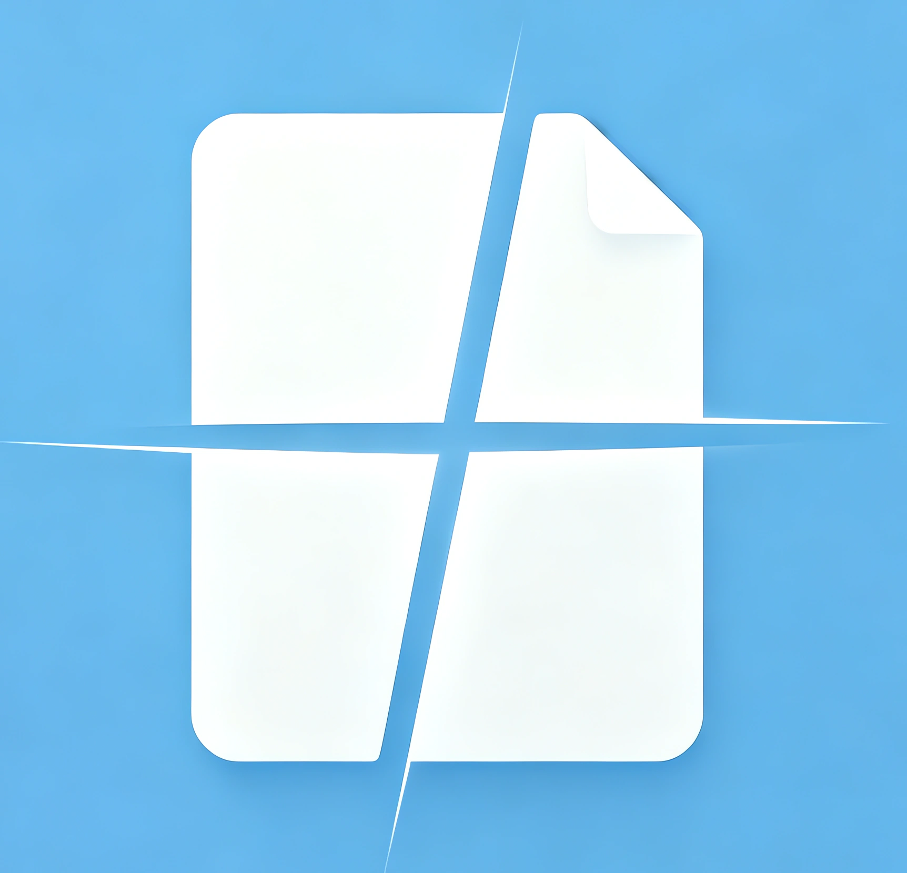
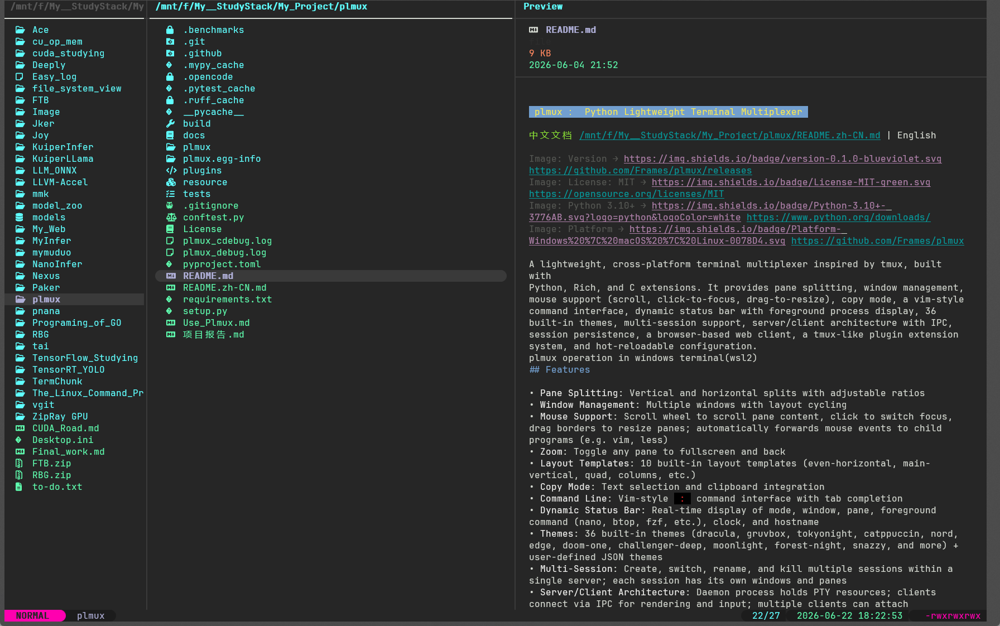

<div align="center">

# FTB - Terminal File Browser

</div>

<div align="center">
  
</div>

<div align="center">

    

[中文文档](README_CN.md)  |  English

</div>

A terminal-based file browser, built with C++17 and [FTXUI](https://github.com/ArthurSonzogni/ftxui). Features a three-column layout (parent / current / preview), vim-like keybindings, syntax-highlighted file preview, and a rich theme system.

<div align="center">
  
  <p>FTB operation in windows terminal(wsl2)</p>
</div>

## Features

### Three-Column Layout
- **Left**: Parent directory listing
- **Center**: Current directory with file icons and type-based coloring
- **Right**: Context-aware preview panel (file metadata, text with syntax highlighting, image rendering, directory contents)

### File Operations
- Copy (y), Cut (x), Paste (p)
- Delete (Delete / Ctrl+D)
- Create new file / folder (via command mode)
- Rename (via command mode)
- Clipboard management with visual indicator
- Open files with default system program (Enter)
- Configurable openers with rules-based matching (Ctrl+B → op/ow)

### Vim-Like Keybindings
- `j`/`k` or Arrow keys to navigate
- `h` to go to parent directory, `l` to enter directory
- `/` to search, `Ctrl+B` prefix mode for commands
- Built-in Vim-like text editor with undo/redo, search/replace, and Markdown preview

### Syntax Highlighting
- Built-in keyword-based highlighter supporting 40+ languages (C/C++, Python, Rust, Go, Java, JavaScript, TypeScript, etc.)
- 16 token types: keyword, string, comment, number, function, type, operator, preprocessor, and more
- Optional tree-sitter backend for advanced parsing (build with `-DFTB_ENABLE_TREE_SITTER=ON`)
- Theme-aware colors that adapt to the active theme

### Image Preview
- Renders JPG, PNG, BMP, GIF images in the terminal
- Unicode half-block character rendering (built-in, no dependencies)
- Optional libchafa backend for better quality (`-DFTB_ENABLE_LIBCHAFA=ON`)
- Optional libsixel backend for native terminal image output (`-DFTB_ENABLE_LIBSIXEL=ON`)
- Extensible protocol layer: supports sixel currently, with architecture ready for Kitty, iTerm2, and other terminal image protocols

### Theme System
18 built-in themes with full syntax color support:

| Theme | Style | Theme | Style |
|-------|-------|-------|-------|
| default | Catppuccin Mocha | yazi | Yazi-inspired |
| dark | High contrast dark | light | Light background |
| colorful | Vibrant colors | minimal | Monochrome |
| dracula | Dracula | nord | Nord |
| tokyo-night | Tokyo Night | gruvbox | Gruvbox |
| solarized | Solarized Dark | one-dark | One Dark |
| rose-pine | Rose Pine | kanagawa | Kanagawa |
| everforest | Everforest | monokai | Monokai |
| ayu | Ayu Dark | poimandres | Poimandres |
| material | Material Dark | horizon | Horizon |
| melange | Melange | solarized-light | Solarized Light |
| ... | ... | ... | ... |

- Real-time theme switching via command mode (`:theme`)
- JSON config file (`~/.ftb`) for persistent customization
- Per-theme syntax highlighting colors

### Command Mode (nvim-style)
Press `Ctrl+B` to enter prefix mode, then type commands:

| Command | Alias | Action |
|---------|-------|--------|
| `:theme` | `:th` | Open theme selector |
| `:rename` | `:rn` | Rename selected item |
| `:newfile` | `:nf` | Create new file |
| `:newfolder` | `:nd` | Create new folder |
| `:preview` | `:p` | Full file preview |
| `:details` | `:d` | Folder details |
| `:jump` | `:j` | Jump to directory |
| `:vim` | `:v` | Open in Vim editor |
| `:search` | `:s` | Enter search mode |
| `:calendar` | `:cal` | Calendar panel |
| `:layout` | `:lo` | Layout settings |
| `:help` | `:h` | Help panel |
| `:plugin` | `:pl` | Plugin manager |
| `:ssh` | - | SSH connection (if enabled) |
| ... | ... | ... |

### Performance
- Asynchronous file I/O for non-blocking UI
- LRU cache for directory contents
- Object pooling for Vim editor instances
- Lazy loading for preview content
- Configurable refresh intervals

### Plugin System
- TypeScript/JavaScript plugins with sandboxed execution
- Permission-based API (fs, clipboard, env, subprocess)
- Plugin manager panel (`:plugin`)
- Auto-discovery from `~/.config/ftb/plugins/`
- Hot reload support
- See [Plugin Guide](docs/PLUGINS.md) for details

## Build

### Dependencies

| Library | Purpose | Required |
|---------|---------|----------|
| FTXUI | Terminal UI framework | Yes |
| nlohmann-json | JSON config parsing | Yes |
| libssh2 | SSH connections | No (`-DFTB_ENABLE_SSH=ON`) |
| tree-sitter | Advanced syntax highlighting | No (`-DFTB_ENABLE_TREE_SITTER=ON`) |
| libchafa | Advanced image preview | No (`-DFTB_ENABLE_LIBCHAFA=ON`) |
| libsixel | Native terminal image output | No (`-DFTB_ENABLE_LIBSIXEL=ON`) |
| QuickJS | Plugin system runtime | No (plugins require `qjs`) |

### Install dependencies (Ubuntu/Debian)

```bash
sudo apt-get update && sudo apt-get install -y \
    libftxui-dev nlohmann-json3-dev cmake g++

# Optional: native sixel image support
sudo apt-get install -y libsixel-dev
```

### Build

```bash
mkdir build && cd build
cmake ..
make -j$(nproc)
```

### Build options

```bash
# Disable Nerd Font icons (use ASCII fallback)
cmake .. -DFTB_ENABLE_ICONS=OFF

# Enable SSH support
cmake .. -DFTB_ENABLE_SSH=ON

# Enable tree-sitter syntax highlighting
cmake .. -DFTB_ENABLE_TREE_SITTER=ON

# Enable libchafa image preview
cmake .. -DFTB_ENABLE_LIBCHAFA=ON

# Enable libsixel native image output 
cmake .. -DFTB_ENABLE_LIBSIXEL=ON

# Disable plugin system
cmake .. -DFTB_ENABLE_PLUGINS=OFF

# Use interactive script for building
chmod +x ./build.sh
./build.sh
```

### Docker

Run FTB in a container without installing dependencies locally:

```bash
# Build with mirror (recommended in China)
docker build --build-arg GIT_MIRROR=https://gh-proxy.com/https://github.com -t ftb .

# Run
docker run -it --rm -v ~/.ftb:/root/.ftb -v ~/:/mnt/host ftb
```

See [Docker Guide](docs/DOCKER.md) for details.

## Usage

```bash
# Launch in current directory
./FTB

# Launch in specific directory
./FTB /path/to/directory

# With performance logging
./FTB -l

# Specify config file
./FTB --config /path/to/config.ftb
```

### Keybindings

| Key | Action |
|-----|--------|
| `j` / `Down` | Move down |
| `k` / `Up` | Move up |
| `h` / `Left` | Parent directory |
| `l` / `Right` / `Enter` | Enter directory / open file with default program |
| `/` | Search |
| `Ctrl+B` | Command mode |
| `y` | Copy |
| `x` | Cut |
| `p` | Paste |
| `Delete` / `Ctrl+D` | Delete |
| `Alt+J` / `Alt+K` | Preview scroll down / up |
| `Alt+H` / `Alt+L` | Preview scroll left / right |
| `Ctrl+R` | Reload config |
| `Ctrl+C` | Quit |
| `Escape` | Close panel / clear search |
| `Home` / `End` | Jump to first / last item |
| `PageUp` / `PageDown` | Scroll pages |

See [Keyboard Shortcuts](docs/KEYBOARD_SHORTCUTS.md) for the full reference.

## Configuration

Copy the template and edit:

```bash
cp config/.ftb.template ~/.ftb
```

The config file uses JSON format. Key sections:

- `colors` - UI colors (main, files, status, search, dialog, syntax)
- `style` - Icons, file size, mouse support, hidden files
- `layout` - Column ratios and items per page
- `theme` - Active theme name
- `ssh` - Default SSH port and timeout
- `bookmarks` - Named directory bookmarks

See [Configuration Guide](docs/CONFIGURATION.md) for details.

## Documentation

- [Keyboard Shortcuts](docs/KEYBOARD_SHORTCUTS.md) ([中文](docs/KEYBOARD_SHORTCUTS_CN.md))
- [Configuration Guide](docs/CONFIGURATION.md) ([配置指南](docs/CONFIGURATION_CN.md))
- [Plugin Guide](docs/PLUGINS.md) ([插件系统](docs/PLUGINS_CN.md))
- [External Prerequisites](docs/PREREQUISITES.md) ([外部依赖](docs/PREREQUISITES_CN.md))
- [Docker Guide](docs/DOCKER.md) ([Docker 支持](docs/DOCKER_CN.md))

## License

MIT