<div align="center">

# FTB (Terminal File Browser)

</div>

<div align="center">
  
</div>

    
 

    <a href="#"></img></a>

A powerful terminal-based interactive file browser developed using FTXUI library, providing intuitive directory navigation, file management, **SSH remote connection**, and **MySQL database management** capabilities.

## Demo


## Features

### 🗂️ Core File Management
- Real-time directory content display
- Color-coded items (blue for directories/red for files)
- Top status bar with current time
- Path history stack (support backward navigation)
- Keyboard navigation (↑↓ keys for selection, Enter to enter directories)
- Auto-refresh (100ms UI update interval)
- Directory search functionality
- Memory usage calculation for selected items

### 🛠️ File Operations
- File/folder creation and deletion
- Copy, cut, and paste operations
- File/folder renaming
- Clipboard management
- Attribute preview and file content inspection

### 📝 Advanced Features
- **Vim-Like editing mode** - Built-in text editor
- **Image preview** - Support for JPG, PNG, BMP, GIF
- **Video playback** - MP4, AVI, MKV, MOV, FLV, WMV support
- **Binary file handling** - Smart detection and protection

### 🔗 **SSH Remote Connection** ✨
- **Secure SSH connections** to remote servers
- **Password and key-based authentication**
- **Remote directory browsing**
- **Command execution** on remote hosts
- **Connection status monitoring**
- **Easy-to-use connection dialog**

### 🗄️ **MySQL Database Management** ✨
- **Local and remote MySQL connections** with easy configuration
- **Graphical CRUD operations** through intuitive button interface
- **Database management** - create, delete, and select databases
- **Table operations** - create, delete, and view table structures
- **Data manipulation** - insert, update, delete, and query data
- **SQL query executor** - direct SQL execution with result display
- **Connection status monitoring** and error handling
- **Tabbed interface** for organized database management

### 🎨 **Customizable Theme System** ✨
- **Multiple built-in themes**: default, dark, light, colorful, minimal
- **Customizable colors** for all interface elements
- **Real-time theme switching** with hotkeys
- **Configuration file support** (.ftb) for persistent customization
- **Color schemes** for files, directories, status bars, and dialogs
- **Layout customization** including panel ratios and item counts
- **Style options** for icons, animations, and mouse support

### 🎨 User Experience
- Modern terminal UI with FTXUI
- Responsive design and smooth animations
- Intuitive keyboard shortcuts
- Error handling and user feedback

## Dependencies

```bash
# Install required libraries
sudo apt-get install libftxui-dev libssh2-1-dev

# Install MySQL development library
sudo apt-get install libmysqlclient-dev

# For video/image support (optional)
sudo apt-get install libavcodec-dev libavformat-dev libavutil-dev libswscale-dev libx11-dev
```

## Configuration

FTB uses a `.ftb` configuration file located in your home directory (`~/.ftb`) to customize the interface appearance and behavior.

### Quick Setup

1. **Copy the template**: `cp config/.ftb.template ~/.ftb`
2. **Edit the file**: Customize colors, themes, and settings
3. **Restart FTB**: Changes take effect immediately

### Available Themes

- **default**: Classic blue and white theme
- **dark**: Dark background with high contrast
- **light**: Light background for bright environments
- **colorful**: Vibrant colors for visual appeal
- **minimal**: Clean, monochrome design

### Configuration Sections

- **Colors**: Customize all interface colors
- **Layout**: Adjust panel sizes and item counts
- **Style**: Toggle icons, animations, and features
- **Themes**: Switch between predefined themes
- **MySQL/SSH**: Set default connection parameters

See [Configuration Guide](docs/CONFIGURATION.md) for detailed options.

### Alternative Installation Methods

**CentOS/RHEL/Fedora:**
```bash
sudo yum install mysql-devel mysql
# or
sudo dnf install mysql-devel mysql
```

**Arch Linux:**
```bash
sudo pacman -S mysql
```

## Build & Run
```bash
chmod +x ./build.sh
source ./build.sh      # Run build script
FTB             # Launch application
```

## Uninstall(Local)
```bash
./uninstall.sh

```

## Usage

### 🗂️ Navigation
- **↑/↓**: Navigate file list
- **Enter**: Open selected directory
- **Backspace/←**: Return to parent directory
- **ESC**: Exit program
- **Search box**: Filter files by keyword

### 🛠️ File Operations
- **Ctrl+f**: Create new file
- **Ctrl+k**: Create new directory
- **Delete**: Remove selected item
- **Alt+n**: Rename selected item
- **Ctrl+t**: Copy selected item
- **Ctrl+x**: Cut selected item
- **Ctrl+n**: Paste items
- **Alt+c**: Add to clipboard
- **Alt+g**: Clear clipboard

### 📝 Content Viewing
- **Space**: View item attributes
- **Ctrl+p**: Preview file content
- **Alt+v**: Image/text preview
- **Alt+p**: Video playback
- **Ctrl+e**: Vim-like editor

### 🔗 **SSH Remote Connection**
- **Ctrl+s**: Open SSH connection dialog
  - Enter hostname/IP, port, username
  - Choose password or key authentication
  - Specify remote directory
  - Connect and browse remote files

### 🗄️ **MySQL Database Management**
- **Alt+d**: Open MySQL database management dialog
  - Configure local or remote MySQL connection
  - Manage databases and tables
  - Execute SQL queries with visual results
  - Perform CRUD operations through buttons

### 🎨 **Theme and Configuration**
- **Ctrl+t**: Switch between available themes
- **Ctrl+r**: Reload configuration file
- **~/.ftb**: Customize colors, layout, and behavior
- **Multiple themes**: default, dark, light, colorful, minimal

### 🎯 Advanced Features
- **Ctrl+E**: Enter Vim editing mode for text files
- **Mouse support**: Click to select and navigate

## SSH Connection Example

### Quick Start
1. Press `Ctrl+S` to open the SSH connection dialog
2. Fill in the connection details:
   - **Hostname**: `192.168.1.100` or `server.example.com`
   - **Port**: `22` (default SSH port)
   - **Username**: `your_username`
   - **Authentication**: Choose password or private key
   - **Remote Directory**: `/home/username` (default)
3. Click "Confirm" to establish the connection
4. Browse remote files and execute commands

### Supported Authentication Methods
- **Password Authentication**: Enter your SSH password
- **Key Authentication**: Specify path to your private key file

### Security Features
- Encrypted SSH protocol (libssh2)
- Secure password handling
- Key-based authentication support
- Connection status monitoring

## MySQL Database Management Example

### Quick Start
1. Press `Alt+D` to open the MySQL database management dialog
2. Configure connection settings:
   - **Local Connection**: Use `localhost` or `127.0.0.1` as hostname
   - **Remote Connection**: Enter remote server IP or hostname
   - **Port**: Default `3306` (MySQL standard port)
   - **Username/Password**: Your MySQL credentials
   - **Database**: Optional, can be selected after connection
3. Click "连接" to establish the connection
4. Use the tabbed interface for different operations:
   - **连接设置**: Configure and manage connections
   - **数据库操作**: Create, delete, and select databases
   - **表操作**: Manage tables and perform CRUD operations
   - **查询执行**: Execute custom SQL queries

### Supported Operations
- **Database Management**: Create, delete, and switch databases
- **Table Operations**: Create, delete, and view table structures
- **Data Manipulation**: Insert, update, delete, and query data
- **SQL Execution**: Run custom SQL statements with result display
- **Connection Monitoring**: Real-time connection status and error handling

### Features
- **Smart Connection Detection**: Automatically identifies local vs remote connections
- **Visual CRUD Interface**: Button-based operations for common database tasks
- **Real-time Results**: Immediate display of query results and affected rows
- **Error Handling**: Comprehensive error messages and connection status
- **Tabbed Interface**: Organized workflow for different database operations

## Project Structure

```
FTB/
├── include/                    # Header files
│   ├── FTB/                   # Core FTB headers
│   │   ├── FileManager.hpp
│   │   ├── ThreadGuard.hpp
│   │   ├── FileSizeCalculator.hpp
│   │   ├── Vim_Like.hpp
│   │   ├── DirectoryHistory.hpp
│   │   ├── detail_element.hpp
│   │   ├── ConfigManager.hpp  # Configuration management
│   │   ├── ThemeManager.hpp   # Theme management
│   │   └── HandleManager/
│   │       ├── UIManager.hpp
│   │       └── UIManagerInternal.hpp
│   ├── UI/                    # User interface components
│   │   ├── RenameDialog.hpp
│   │   ├── NewFileDialog.hpp
│   │   ├── NewFolderDialog.hpp
│   │   ├── FilePreviewDialog.hpp
│   │   ├── FolderDetailsDialog.hpp
│   │   ├── SSHDialog.hpp      # SSH connection dialog
│   │   └── MySQLDialog.hpp    # MySQL database management dialog
│   ├── Connection/            # Connection backends
│   │   ├── SSHConnection.hpp  # SSH connection backend
│   │   └── MySQLConnection.hpp # MySQL connection backend
│   └── Video_and_Photo/       # Media handling
│       ├── ImageViewer.hpp
│       └── VideoPlayer.hpp
├── src/                       # Source code
│   ├── FTB/                   # Core FTB implementation
│   │   ├── main.cpp
│   │   ├── FileManager.cpp
│   │   ├── DirectoryHistory.cpp
│   │   ├── detail_element.cpp
│   │   ├── ThreadGuard.cpp
│   │   ├── Vim_Like.cpp
│   │   ├── FileSizeCalculator.cpp
│   │   ├── ConfigManager.cpp  # Configuration management
│   │   ├── ThemeManager.cpp   # Theme management
│   │   └── HandleManager/
│   │       ├── UIManager.cpp
│   │       └── UIManagerInternal.cpp
│   ├── UI/                    # UI components
│   │   ├── RenameDialog.cpp
│   │   ├── NewFileDialog.cpp
│   │   ├── NewFolderDialog.cpp
│   │   ├── FilePreviewDialog.cpp
│   │   ├── FolderDetailsDialog.cpp
│   │   ├── SSHDialog.cpp      # SSH dialog implementation
│   │   └── MySQLDialog.cpp    # MySQL dialog implementation
│   ├── Connection/            # Connection backends
│   │   ├── SSHConnection.cpp  # SSH connection logic
│   │   └── MySQLConnection.cpp # MySQL connection logic
│   └── Video_and_Photo/       # Media handling
│       ├── ImageViewer.cpp
│       ├── VideoPlayer.cpp
│       ├── CommonMedia.cpp
│       └── FFmpegUtils.cpp
├── tests/                     # Test cases
│   ├── UIManagerTest.cpp
│   ├── FileManagerTest.cpp
│   ├── main.cpp
│   ├── Vim_like_Test.cpp
│   ├── CMakeLists.txt
│   └── FileSizeCaculatorTest.cpp
├── config/                    # Configuration files
│   └── .ftb.template         # Configuration template
├── docs/                      # Documentation
│   └── CONFIGURATION.md      # Configuration guide
├── bash_tool/                 # Build scripts
│   ├── build.sh
│   ├── package_build.sh
│   └── uninstall.sh
├── .github/workflows/         # CI/CD
│   └── Release.yml
├── CMakeLists.txt            # Build configuration
├── README.md                 # Documentation
├── QUICK_CONFIG.md           # Quick configuration guide
├── test_config.sh            # Configuration test script
├── .gitignore
├── Release_notes.md
├── cmake_uninstall.cmake.in
├── .clang-format             # Code style
└── License
```

## Development Environment
- Compiler: g++ 11.0+
- Build tool: CMake 3.20+
- Dependencies: FTXUI 5.0+, libssh2, libmysqlclient

## License

MIT License